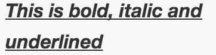

# Silverfin Templating Language

The Silverfin Templating Language (STL) is based on two technologies: [Liquid](https://shopify.github.io/liquid/) for logic and accessing content and [Markdown](https://daringfireball.net/projects/markdown/syntax) for styling. This guide aims to explain how these technologies can be used to create templates and texts and can be used as a reference to see where STL differs from the original technologies. Features from Liquid or Markdown that are not explicitly mentioned in this guide might work, but are not officially supported.

## Styling

### Basic styling

STL supports basic styling of text

| Style       | Syntax  | Example                 | Output
| ----------- | ------- | ----------------------- | -------
| Bold        | `** **` | `**This is bold**`      | **This is bold**
| Italic      | `* *`   | `*This is italic*`      | *This is italic*
| Underline   | `_ _`   | `_This is underlined_`  | 
| Bold & Italic & Underlined | `***_ _***` | `***_This is bold, italic and underlined_***` |  


### Tables

A table is mainly constructed with `|`. It consists of an optional header line that defines the markup of the table, and rows. A simple table can look like this:

```
| A table header | Another table header  |
|----------------|-----------------------|
| Table content  | other table content   |
| 2nd row content| other 2nd row content |
```

* **Before and after a table there must's an empty line.**
* Alignment of the `|` is not necessary and only allows for better reading.
* The table header is optional

Alignment is done by adding semi colons to the table header:

```
|:-----------------:|----------------------:|:----------------|
| centered content  | right aligned content | left aligned content (default)
```


## Logic

Logic in STL is based on two important parts:

* [Drops](#drops) to access data from Silverfin, these can be considered as variables
* [Tags](#tags) to facilitate logic and more complex behaviour

### Drops

| Drop        | Description  | Availability
| ----------- | ------------ | ---------
| [company](https://github.com/GetSilverfin/sf-templates/blob/master/drops/company.md) | a file | Root
| [period](https://github.com/GetSilverfin/sf-templates/blob/master/drops/period.md)   | an accounting period | Root
| [person](https://github.com/GetSilverfin/sf-templates/blob/master/drops/person.md)      | a person related to a company | On period
| [account](https://github.com/GetSilverfin/sf-templates/blob/master/drops/account.md) | an account for a specific period | On period
| detail      | a detail/explanation for an account for a specific period  | On account
| transaction | a booking for an account, coming from the accountancy tool | On account
| [custom](https://github.com/GetSilverfin/sf-templates/blob/master/drops/custom.md)      | a means to enter and access custom information | On period, detail, account and company

### Tags

In Silverfin there are two modes:

* input mode: this shows input fields where defined with [input](https://github.com/GetSilverfin/sf-templates/blob/master/tags/input.md) tags and might show extra lines in [custom](https://github.com/GetSilverfin/sf-templates/blob/master/drops/custom.md) collections when used with a `fori` tag
* show mode: this mode converts all inputs to regular text, this is mainly used when data is exported and for external access

| Tag         | Description  | Example
| ----------- | ------------ | ----------
| [input](https://github.com/GetSilverfin/sf-templates/blob/master/tags/input.md) | Used together with a [custom](https://github.com/GetSilverfin/sf-templates/blob/master/drops/custom.md), it allows users to enter information | `
| `inputcomment` (alias `ic`) | Used to show content only when in 'input' mode  | ` this is only shown in input mode `
| `noinputcomment` (alias `nic`) | Used to show content only when in 'input' mode | ` this is only shown in input mode `
| `assign` | Used for assignment of variables | ``
| `linkto` | Used to link to an object (currently only works for accounts)| `this is linked to an account`
| `ifi`    | Same as if, but always executed when in input mode | `this is shown when in input mode or some_var is filled in`
| `fori`   | Same as for, but adds an extra non-existing item to [custom](https://github.com/GetSilverfin/sf-templates/blob/master/drops/custom.md) drops when in input mode | ``
| `unexplained` | Used to define one or multiple values that need to be 0 to make regard the template as explained | ``
| `t=` | Define translations for a string | ``
| `t`  | Translate a string (translations need to be defined already before this tag with `t=` | ``
| `result` | Defines a result so it can be reused in another template. To access these variables, you need to add a handle to the reconciliation text. To access the results, you have to go through the period drop: `period.reconciliations.handle_of_reconciliation.results.total` | ``
