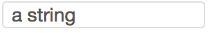
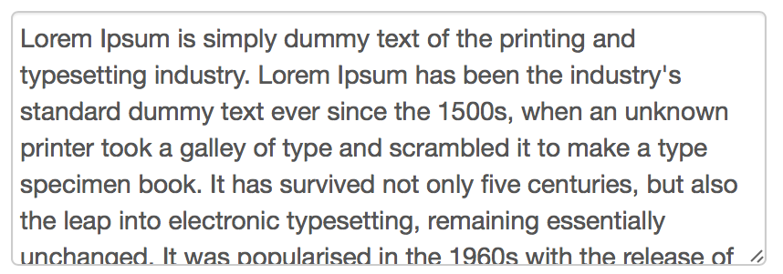
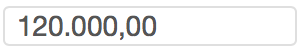
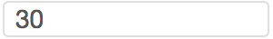
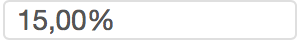
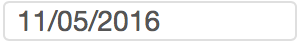
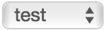

# input - [tag](https://github.com/GetSilverfin/sf-templates/blob/master/README.md#tags)

## `input`

Creates an input field for a [custom drop](https://github.com/GetSilverfin/sf-templates/blob/master/README.md#tags). This allows the user to enter text which can be used later on in the 

```

```

## Input types

To define what kind of input you want to show, you can modify the `as` parameter. Following types are currently supported:

| type       | description | what's shown as input | what's printed   | data stored |
|------------|-------------|-----------------------|------------------|-------------|-------------|
| string     | the default, just plain text                                              |         | some text  | "some text"
| text       | similar to string, but provides a bigger text field as input              |         | some text  | "some text"
| currency   | a numeric value, properly formatted with decimal and thousands separators |         | 1.234,00   | "1234.00"
| integer    | a numeric value without decimals                                          |         | 1.243      | "1243.00"
| percentage | a percentage value                                                        |         | 34,12%     | "0.3412"
| boolean    | true or false                                                             |         | (empty)    | "true"
| date       | a date (no time)                                                          |         | 19/09/1985 | "1985-09-19"
| account_collection | an input field that allows to select multiple accounts            |         | (empty)    | "600000,610000,618200"
| file       | an input field that allows to select documents                            |         | Attachment 3 | (the actual document)
| select     | an input field to select multiple values                                  |         | the selected value | "the selected value"

## Common parameters

### `placeholder`

```

```

This guides the user what to fill in. 


### `default`

```

```

### `placeholder_default`

```

```
